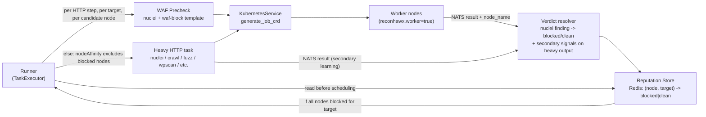

# WAF-Aware Worker Quarantine — high-level design

## Problem

Recon tasks that issue outbound HTTP requests (`test_http`, `crawl_website`, `fuzz_website`, `nuclei_scan`, `screenshot_website`, `wpscan`) can hit a WAF that blocks the worker's egress IP. Because pod egress is SNAT'd to the node IP, **the block is per worker node, not per pod**. Some nodes may be blocked while others can still reach the same target. Today the runner has no notion of "this node is blocked for this target", so it keeps creating Jobs that produce 403 storms, useless nuclei runs, and challenge-page screenshots.

## Goal

Stop scheduling HTTP recon work on a worker node that we already know is being blocked by the target's WAF, while still using clean nodes. Reputation is per `(node, target)` where **target is the actual URL/host the heavy task will probe** — not the apex domain — because WAF policy commonly varies between subdomains and even between paths (`api.example.com` may block while `www.example.com` is open). Recovery is automatic via TTL.

## Architecture (high level)

## Building blocks

### 1. Worker identity in every result envelope (foundation)

Every NATS result must carry the node the work ran on so the runner can attribute verdicts.

- Inject `NODE_NAME` into worker pods via Kubernetes Downward API (`spec.nodeName`) in [src/runner/app/services/kubernetes.py](src/runner/app/services/kubernetes.py) `generate_job_crd`.
- Include `node_name` (and `pod_name`) in the result envelope published by [src/worker/app/command_wrapper.py](src/worker/app/command_wrapper.py) `publish_result`.
- Surface it in [.cursor/rules/runner-architecture.mdc](.cursor/rules/runner-architecture.mdc) so future task authors know it exists.

This is small but unblocks everything else.

### 2. Detection mechanism — nuclei with a custom WAF-block template

Detection is centralized as a **custom nuclei template bundle** (e.g. `src/runner/templates/waf-block/`, baked into the worker image). The runner runs `nuclei` against the precheck target with `-t waf-block/` and inspects the resulting findings.

The template's responsibility is to distinguish **"the WAF is blocking us right now"** from **"this site is fronted by a WAF"** — the latter is not a block. So matchers must combine vendor fingerprints with block-page evidence, not just a `Server:` header. Examples of patterns the template should fire on:

- Cloudflare: 403/503 + body `Attention Required! \| Cloudflare` / `Sorry, you have been blocked` / `cf-chl-bypass`.
- Akamai: 403 + body `Reference #` / header `Server: AkamaiGHost` with denial body.
- Imperva / Incapsula: header `x-iinfo` / `x-cdn: Incapsula` + 403/captcha body.
- AWS WAF: 403 + body `Request blocked` and `x-amzn-RequestId` + `x-amzn-ErrorType`.
- F5 BIG-IP ASM: body `The requested URL was rejected` / `Support ID: \d+`.
- Sucuri: header `x-sucuri-id` + 403 body `Access Denied`.
- Generic captcha challenge: matchers for hCaptcha / reCAPTCHA / Turnstile script tags + non-200.

Each matcher tags its `info.name` with the detected vendor, which becomes structured **evidence** flowing back via the existing nuclei output path in [src/runner/app/recon_tasks/nuclei_scan.py](src/runner/app/recon_tasks/nuclei_scan.py).

A thin **verdict resolver** in `src/runner/app/utils/waf_detection.py` converts:

- precheck nuclei output → `blocked_waf | accessible | unknown` (any waf-block template hit ⇒ `blocked_waf`),
- heavy-task output (secondary signal, optional) → coarse hints like "≥80% 403 ratio" or screenshot OCR matching block phrases.

The precheck verdict is authoritative; the heavy-task secondary signal exists only to catch nodes that pass precheck but trip a WAF later in the workflow.

Why nuclei over a custom probe:

- Reuses an existing worker binary; no new tool, no new flags spelunking.
- Detection rules live as YAML — operators add new WAFs without code changes.
- Output is already structured JSON the runner ingests today.
- Vendor name in the matched template doubles as evidence on the step status.

### 3. Reputation store in Redis

A new module, e.g. `src/runner/app/services/waf_reputation.py`, with three operations:

- `record(node, target, verdict, evidence)` — promotes `(node, target)` to `blocked` after a precheck verdict (precheck is authoritative) or after N secondary signals within window M from heavy tasks.
- `is_blocked(node, target) -> bool` — TTL-based read.
- `blocked_nodes_for(target) -> set[str]` — used at scheduling time.

Quarantine TTL (e.g. 30–60 min) gives automatic recovery; admin override comes later. Keys are namespaced so a global `flushdb` isn't needed during dev.

**Target granularity:** the key is the **full target the heavy task is going to probe** (scheme + host + port at minimum, or the full URL when the task input is URL-shaped). WAF policy varies between subdomains and even paths, so apex-level keying would be too coarse and cause false positives. The reputation module exposes a small `target_key(input)` helper so callers don't have to agree on URL canonicalization rules.

### 4. Pre-step WAF precheck (the gate)

Right before each of the six HTTP tasks runs, the runner inserts a precheck against the **actual targets** of that step (the URLs/hosts the heavy task is about to scan, deduplicated). The precheck is a small nuclei Job using the custom waf-block template bundle, scheduled one (or a few) per candidate worker node so we learn which nodes can reach the target.

For each `(target, candidate_node)` combination not already covered by a recent verdict in Redis, the precheck runs once and writes a verdict via `record()`. Then the heavy task is dispatched **with `nodeAffinity` excluding all currently-blocked nodes for those targets** — extend [src/runner/app/services/kubernetes.py](src/runner/app/services/kubernetes.py) `generate_job_crd` to accept an `excluded_nodes` list and emit a `requiredDuringSchedulingIgnoredDuringExecution` NodeAffinity term alongside the existing `nodeSelector`.

If **all** worker nodes are blocked for a given target, the heavy task is **not dispatched** for that target. The step is marked `skipped: waf_blocked` (with the target and the matched WAF vendor on the step status), and dependent steps see this and decide whether to continue. This is what stops "scanning for nothing".

When a step has many targets (e.g. `test_http` with hundreds of URLs), the precheck only runs on a representative sample per host (already a small fixed cost per `(host, node)`), and the reputation module deduplicates probes by `target_key(input)`.

The precheck is task-agnostic: same Job shape, same template bundle, same envelope, same verdict resolver as heavy-task secondary signals. Implementation shape can be either an implicit helper called by `TaskExecutor` or an injected `waf_precheck` workflow step — either is acceptable at this level of the design.

### 5. Continuous learning from heavy tasks (secondary signal)

The verdict resolver also runs on heavy-task output, so a node that *passed* precheck but tripped a WAF mid-workflow still updates reputation for the next step. This is "free" — every `parse_output` already runs in the runner; we just call the resolver and `record()` after parsing. The signals here are intentionally weak (status-code distribution, OCR phrases) and only promote to `blocked` after multiple confirmations, since the precheck is the authoritative signal.

### 6. Observability and operator levers

- Step status gains a `waf_status: {verdict, vendor, node, target}` block, mirroring how `input_validation` is surfaced today (see [AGENTS.md](AGENTS.md) "input validation").
- Structured log line on every classification (so Loki/Grafana can chart blocked rate by node, by target, and by WAF vendor).
- Admin endpoint to list current quarantines and force-clear `(node, target)` (small superuser UI later — not in the first cut).
- Env-driven kill switch `WAF_DETECTION=off` on the runner pod for parity with `RUNNER_INPUT_VALIDATION`.

## What is intentionally out of scope (first cut)

- Mid-flight Job kill from inside the worker. The precheck design already prevents most wasted work; tearing down a running Job adds NATS/k8s plumbing we can defer.
- Egress-IP-based quarantine (for clusters using egress gateways where multiple pods can share a non-node IP). Reputation key is shaped as `(node, target)` now but lives behind a small abstraction so swapping to `(egress_id, target)` later is mechanical.
- Canary probes from quarantined nodes — TTL recovery is enough for v1.
- Admin UI for quarantine management — log/Redis inspection is enough for v1.

## Touchpoints summary

- `src/runner/templates/waf-block/` (new) — custom nuclei template bundle with vendor matchers; baked into the worker image and referenced via `-t waf-block/`.
- [src/runner/app/services/kubernetes.py](src/runner/app/services/kubernetes.py) — Downward API env, NodeAffinity exclusions in `generate_job_crd`.
- [src/worker/app/command_wrapper.py](src/worker/app/command_wrapper.py) — include `node_name` / `pod_name` in result envelope.
- `src/runner/app/utils/waf_detection.py` (new) — verdict resolver (precheck nuclei output → verdict; secondary signals on heavy output).
- `src/runner/app/services/waf_reputation.py` (new) — Redis-backed `(node, target)` reputation with `target_key()` helper.
- [src/runner/app/task_executor.py](src/runner/app/task_executor.py) — precheck gate before the six HTTP tasks; abort step when all nodes blocked for a target.
- The six task modules under [src/runner/app/recon_tasks/](src/runner/app/recon_tasks/) — feed `parse_output` results into the resolver and record secondary verdicts.
- [.cursor/rules/runner-architecture.mdc](.cursor/rules/runner-architecture.mdc), [.cursor/rules/runner-task-patterns.mdc](.cursor/rules/runner-task-patterns.mdc), [AGENTS.md](AGENTS.md) — document `node_name` envelope field, the nuclei-based precheck, the `waf_status` shape, and the `WAF_DETECTION` kill switch.

