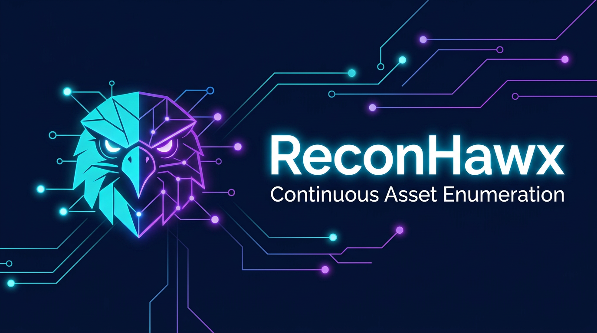

# ReconHawx

**ReconHawx** is a platform for **continuous asset enumeration** and security reconnaissance. It brings together orchestrated workflows, discoverable infrastructure, and a unified UI so teams can run and observe recon programs at scale—from domain inventory and findings to certificate transparency monitoring and automation pipelines.

## What You Can Do With It

- **Programs and assets** — Organize scope, track discovered domains and related assets, and keep enumeration work structured.
- **Workflow automation** — Define and run multi-step recon workflows with job orchestration suitable for Kubernetes and batch execution.
- **Findings and signals** — Collect and review output from scanners and tooling (for example template-based checks) in one place.
- **Certificate transparency** — Monitor CT logs to detect potential typosquat domains impersonating your brand.
- **Event-driven processing** — Use a message backbone so tasks and notifications integrate cleanly across services.

## Architecture

ReconHawx is a multi-service system designed for production deployment on Kubernetes (including queue-aware scheduling for workflow jobs):

| Component | Role |
|-----------|------|
| **API** | FastAPI backend — programs, assets, workflows, auth, and orchestration hooks. |
| **Frontend** | React application for dashboards, programs, workflows, and findings. |
| **Runner** | Workflow and batch job orchestration. |
| **Worker** | Executes workflow tasks dispatched by the runner. |
| **CT Monitor** | Watches certificate transparency logs. |
| **Event Handler** | Consumes and handles events from the messaging layer. |

Supporting pieces include **PostgreSQL** for persistence, **NATS** (with JetStream) for messaging, **Redis**, and **Kueue** for job queueing in cluster environments.

## Documentation and Setup

- **[`docs/installation-on-minikube.md`](docs/installation-on-minikube.md)** — Follow this procedure to install ReconHawx on Minikube
- More documentation to come
