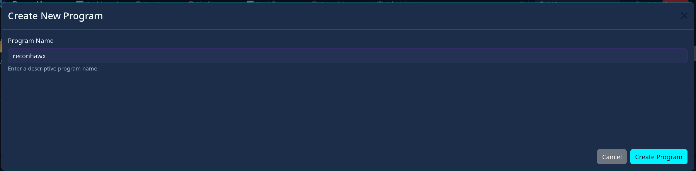
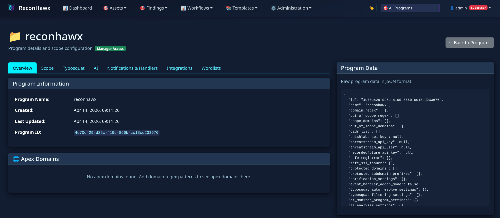
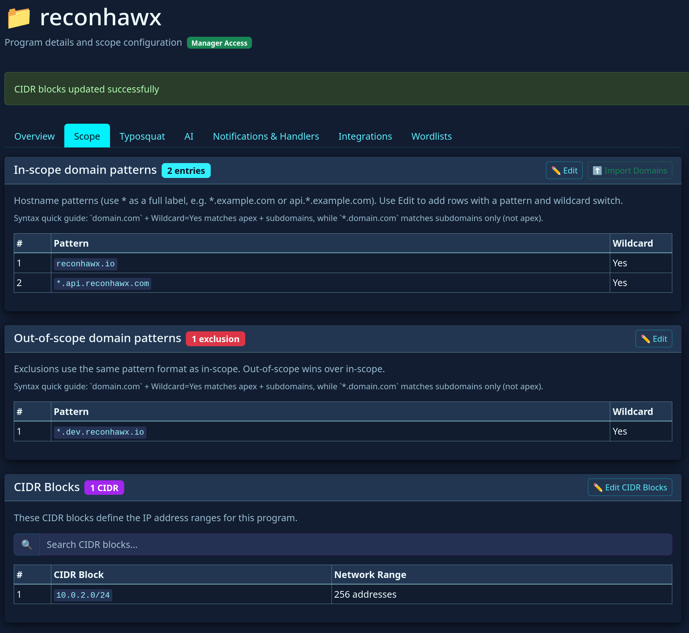
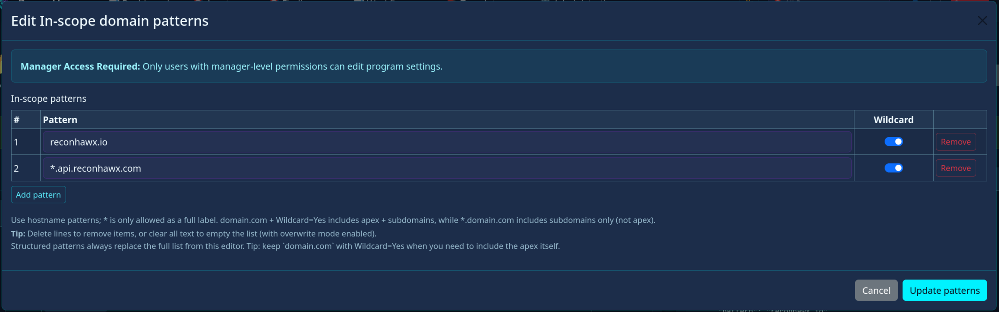
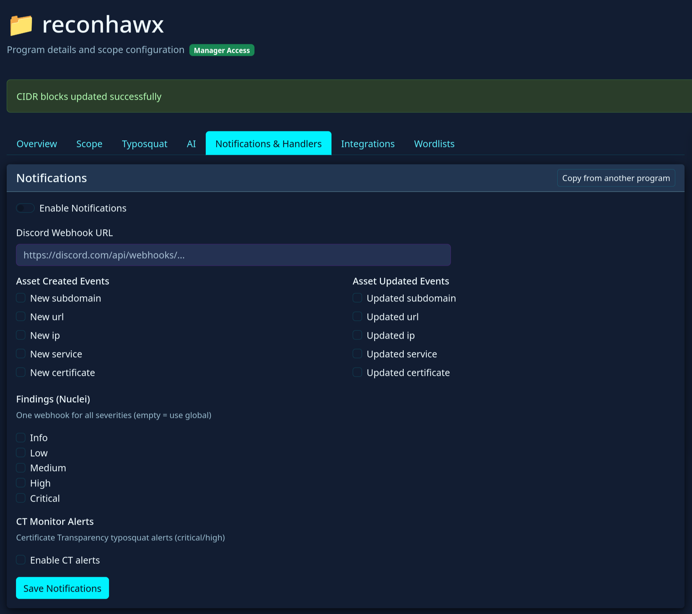

# Programs Guide (User Documentation)

This guide explains how to use **Programs** in ReconHawx and what each setting is for. It is written for operators and analysts using the UI.

A Program defines:
- What is in scope
- What is out of scope
- How typosquat and CT monitoring behave
- How notifications and event handlers behave for that program
- Optional per-program integration credentials

## Before you start

- You should have access to the UI and permission to manage programs.
- If this is your first session, review [Getting Started](getting-started.md) first.

## Where to manage Programs

- In the top navigation bar, open **Programs** to see the program list and create a new program.
- Click a program name from the list to open its detail page and advanced settings tabs.

---

## 1) Program creation

From **Programs**, use **Create Program** to create the program identity first, then configure scope and all advanced settings on the program detail page.

### Program name

What it is for:
- Human-readable identifier for the program across the UI.

How to choose it:
- Use a stable name you can keep long term (for example company or environment based).
- Keep naming consistent across teams.

Notes:
- Program names can be any non-empty value; choose a stable and clear naming convention for your team.
- In the UI, the program name is treated as immutable after creation.

### What happens after creation

- After you create the program, ReconHawx opens that program's detail page automatically.
- Use the detail tabs to set:
  - Scope domains and exclusions
  - Legacy regex and CIDR ranges (if needed)
  - Typosquat/CT settings
  - Notification and integration settings

---

## 2) Scope settings on Program detail

From **Programs**, open a program and use the **Scope** tab to define clear boundaries.

### Structured in-scope domain patterns

What it is for:
- Primary way to define what domains belong to the program.

How it works:
- You add domain patterns (with optional wildcard behavior).
- These are easier to reason about than freeform regex.

Detailed behavior (`*.domain.com` vs `domain.com` and wildcard):

- `domain.com` (no wildcard):
  - Matches the exact apex domain only.
  - Use this when you want to include just the root name.

- `*.domain.com` (wildcard-style include):
  - Matches subdomains under `domain.com` (for example `api.domain.com`, `dev.domain.com`, `a.b.domain.com`).
  - Treat this as "include descendants under this zone."

- `domain.com` + wildcard option enabled in structured scope:
  - Operationally similar to wildcard-style include for subdomains.
  - Use this when the UI provides a separate wildcard toggle instead of typing `*` directly.

Practical recommendation:
- If you want full coverage, include both:
  - exact apex (`domain.com`)
  - wildcard subdomains (`*.domain.com` or wildcard toggle on the same entry)
- This avoids confusion about whether apex and descendants are both included.

Examples:
- Tight include: `payments.example.com` (exact only)
- Broad include: `*.example.com` (all subdomains)
- Typical production setup: `example.com` + `*.example.com`

When to use:
- For most programs, this should be your main scope definition.

### Structured out-of-scope domain patterns

What it is for:
- Explicitly excludes domains or subtrees from processing.

Important behavior:
- Exclusions override broad include patterns.

When to use:
- Shared infrastructure, third-party zones, staging noise, or disallowed targets.

Examples:
- Exclude all staging hosts: `*.staging.domain.com`
- Exclude one sensitive subtree: `internal.domain.com` + wildcard include for descendants
- Exclude a third-party delegated zone: `*.vendor.domain.com`

### Legacy in-scope / out-of-scope regex (advanced fallback)

What it is for:
- Additional advanced matching when structured patterns are not enough.

Recommendation:
- Keep these minimal and documented in your team.
- Prefer explicit structured scope first.

### Scope best practices

- Start with a narrow, high-confidence scope.
- Add exclusions early to avoid noisy processing.
- Expand scope only after validating outputs in asset views.
- Revisit scope after each major workflow run.

---

## 3) Typosquat and CT monitoring settings

Use these settings when you want proactive detection of suspicious lookalike domains and certificate activity.

### CT monitoring enabled

What it is for:
- Turns certificate transparency monitoring on/off for this program.

When enabled:
- Program-specific CT logic and related settings are applied.

When disabled:
- CT-driven monitoring and related notifications for this program are reduced or inactive.

### CT monitor program settings

#### TLD filter

What it is for:
- Restricts monitoring focus to selected TLDs.

How to use:
- Set this if your organization only operates in specific TLD spaces.
- Leave broad if you want wider suspicious domain coverage.

#### Similarity threshold

What it is for:
- Controls sensitivity when comparing discovered names to protected domains.

How to tune:
- Lower threshold: more findings, more noise.
- Higher threshold: fewer findings, stricter matching.

### Protected domains

What it is for:
- Canonical domains that should be protected (for example your official apex domains).

Why it matters:
- Core reference list for typosquat similarity matching.

### Protected keywords

What it is for:
- Keywords strongly associated with your brand/business.

Why it matters:
- Helps detect suspicious names even when domain similarity alone is weaker.

### Typosquat filtering settings

#### Enable filtering

What it is for:
- Activates/deactivates filtering logic for typosquat candidate handling.

#### Minimum similarity percent

What it is for:
- Minimum similarity required for findings to remain active.

How to tune:
- Increase to reduce noise.
- Decrease to catch more edge cases.

#### Whitelisted apex domains

What it is for:
- Domains you explicitly trust and do not want flagged.

How to use:
- One apex domain per line.
- Keep list reviewed and minimal.

Operational note:
- Adding whitelist entries can auto-dismiss matching open typosquat findings.

### Typosquat auto-resolve settings

#### Minimum parked confidence percent

What it is for:
- Confidence threshold for treating a finding as parked/low-risk and auto-resolving.

#### Minimum similarity with protected domain percent

What it is for:
- Similarity threshold used by auto-resolve logic.

How to tune:
- Conservative teams should start with stricter (higher) thresholds.
- Relax only after reviewing false negatives.

### Safe registrars / Safe SSL issuers (also shown here)

These fields may also appear in Typosquat context because they influence trust and triage quality.

---

## 4) AI settings

### Typosquat analysis prompt

What it is for:
- Optional custom prompt used by AI-driven typosquat analysis for this program.

When to customize:
- You need organization-specific risk criteria, wording, or triage priorities.

Recommendation:
- Start with default behavior.
- Customize only with clear review criteria and measurable improvement.

---

## 5) Notifications and handlers settings

This section controls what events generate notifications and where they are sent.

### Notifications enabled

What it is for:
- Global on/off switch for program-level notifications.

### Global Discord webhook URL

What it is for:
- Default webhook destination for this program's notifications.

How it behaves:
- Event-specific webhook overrides can replace this for selected event types.

### Asset event notifications by asset type

Available asset types:
- Subdomain
- URL
- IP
- Service
- Certificate

For each type you can configure:
- **Enabled**: whether events for that asset type should notify.
- **Webhook URL override**: optional destination only for that asset type.

### Nuclei findings notifications

What it is for:
- Notifications for new findings, with selectable severity levels:
  - info
  - low
  - medium
  - high
  - critical

How to use:
- Start with medium/high/critical in production if you want lower alert volume.
- Add low/info only when triage capacity allows.

### CT alert notifications

What it is for:
- Notifications for certificate-transparency-related alerts.

Options:
- Enabled toggle
- Optional webhook override

### Use global defaults (event handler mode)

What it is for:
- Decide whether this program uses global event-handler defaults or custom per-program handler additions.

Recommendation:
- Keep global defaults on unless you have a clear program-specific integration need.

---

## 6) Integrations settings

Use this section for optional per-program integration credentials.

### Phishlabs API key

What it is for:
- Enables Phishlabs integration features for this program.

### RecordedFuture API key

What it is for:
- Enables Recorded Future integration features for this program.

### Threatstream API user and API key

What it is for:
- Enables Threatstream integration features for this program.

### Credential handling recommendations

- Use dedicated service credentials per environment where possible.
- Rotate keys regularly.
- Remove unused credentials from old programs.

---

## 7) How to tune settings over time

A practical iteration loop:

1. Start with strict scope and conservative alert thresholds.
2. Run a small workflow or single task.
3. Review asset and finding quality.
4. Adjust scope, typosquat thresholds, and notification volume.
5. Repeat until noise is manageable and coverage is acceptable.

---

## Common mistakes to avoid

- Over-broad in-scope patterns at the start.
- Missing out-of-scope exclusions for shared infrastructure.
- Very low typosquat thresholds without triage capacity.
- Enabling all low-severity notifications immediately.
- Leaving stale third-party integration credentials configured.

## Related documentation

- [Getting Started](getting-started.md)
- [Installation on Kubernetes](../install-on-kubernetes.md)
- [Installation on Minikube](../install-on-minikube.md)
- [Upgrading ReconHawx on Kubernetes](../update-reconhawx.md)
