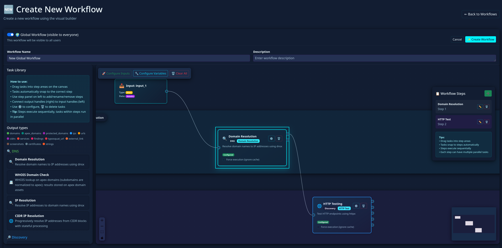

# Workflows Guide (User Documentation)

This guide explains how to build and run workflows in ReconHawx, with a focus on practical usage in the UI.

It covers:
- How to create and structure workflows
- How workflow inputs work
- Common task input types you will configure
- Validation and troubleshooting basics

It intentionally does **not** go deep into individual runner task internals; that belongs in a separate task-focused guide.

## Before you start

- You should already have at least one Program configured.
- If you are new to the platform, read [Getting Started](getting-started.md) first.

## Where to manage workflows

- In the top navigation bar, open **Workflows**.
- Use:
  - **Create workflow** to build or edit workflow definitions
  - **Run workflow** to execute saved/visual/custom workflows
  - **Workflow status** to monitor runs and inspect logs

---

## 1) Build a workflow

### Step 1: Open the builder

1. Go to **Workflows**.
2. Select **Create workflow** (or edit an existing one).
3. Enter a clear workflow name and optional description.
4. Choose the target Program.

### Step 2: Add tasks

1. In the **Task Library**, drag tasks into the canvas.
2. Organize tasks into steps:
   - Tasks in the **same step** can run in parallel.
   - **Next steps** run after previous steps complete.
3. Save often while building.

### Step 3: Configure each task

1. Open a task node and select **Configure**.
2. Set task parameters in **Parameters**.
3. Review task-level options in **Options** (for example proxy-related toggles when available).
4. Confirm input mapping so each task receives the expected data source.

### Step 4: Review workflow-level inputs and variables

1. Open **Configure Inputs** to define workflow input sources.
2. Open **Configure Variables** to define reusable values/templates.
3. Save and run once with a small test input.

---

## 2) Workflow input sources (high level)

Workflow inputs define where task data comes from.

Common source types:

### Direct Input

Use when:
- You want to provide explicit values manually.

Typical examples:
- A short list of domains
- A set of IPs
- A few URLs for a focused test

### Program Asset

Use when:
- You want tasks to consume data already discovered and stored in ReconHawx.

Typical examples:
- Existing subdomains
- Existing URLs
- Existing services or certificates

### Program Finding (where available)

Use when:
- You want to target findings-driven follow-up actions.

### Program Protected Domains / Program Scope Domains

Use when:
- You want workflow input to align directly with the Program’s configured protection/scope boundaries.

---

## 3) Task input types you will configure most often

Different tasks expose different fields, but most task inputs fall into these user-facing types.

## Boolean (true/false)

What it looks like:
- Checkbox or toggle.

Use it for:
- Enabling/disabling optional behavior.

## Number

What it looks like:
- Numeric field.

Use it for:
- Timeouts, limits, depth, concurrency-like values.

Tip:
- If left empty on some tasks, system defaults may apply.

## String (single value)

What it looks like:
- Single-line text field.

Use it for:
- A keyword, one path, one selector value, or one identifier.

## Array/List (multiple values)

What it looks like:
- Multi-line input (often one item per line).

Use it for:
- Multiple domains, templates, flags, words, or patterns.

Tip:
- Keep one logical item per line to make review easier.

## Source selector fields

What it looks like:
- Dropdown/select controls tied to workflow inputs or program assets.

Use it for:
- Choosing which input stream a task should consume.

## Specialized selectors (task-dependent)

Examples:
- Wordlist selector
- Template selector
- Output mode selector

Use it for:
- Choosing predefined resources or mode presets without manual formatting.

---

## 4) Input mapping (important)

Input mapping controls which upstream data each task receives.

How to use it:
1. Open a task node -> **Configure**.
2. In the input mapping area, map each required task input to the correct source.
3. Verify mapping names match your intended flow (for example domains -> domain-consuming task).

Why it matters:
- Most "task ran but gave wrong output" issues come from incorrect input mapping, not task failure.

---

## 5) Run modes (user view)

In **Run workflow**, users commonly work with:

- **Saved workflow mode**: run an existing workflow definition.
- **Visual workflow mode**: build/run from the visual builder.
- **Custom JSON mode**: advanced mode for users who provide JSON directly.

General recommendation:
- Start with saved or visual mode unless your team already standardizes custom JSON workflows.

---

## 6) Validation rules you will notice in the UI

You may see run blocked or field-level errors until required settings are complete.

Common validation checks:
- Target Program selected
- Workflow selected/named (depending on mode)
- At least one task in visual mode
- Required input values present
- Unique input names
- Valid variable/template values when used

How to recover quickly:
1. Resolve top-level errors first (program/workflow/mode completeness).
2. Open each configured task and check required fields.
3. Check input mapping and workflow input sources.
4. Re-run with a minimal test case.

---

## 7) Practical build pattern for new users

Start simple:
1. Build a 1-2 step workflow.
2. Use one clear input source.
3. Configure minimal required task fields.
4. Run and inspect results in **Workflow status**.
5. Expand complexity after the first successful run.

Avoid early complexity:
- Too many tasks in first version
- Mixed input sources without clear mapping
- Broad inputs before validating behavior

---

## Troubleshooting quick reference

- **Run button is disabled**
  - Check Program selection, workflow selection/name, and that visual mode has at least one task.

- **Workflow ran but output is not what you expected**
  - Check each task's input mapping first.

- **Input filter or source selection fails**
  - Simplify to one source and one simple filter, then add complexity.

- **Variable/template errors**
  - Fill all required variables and verify placeholders resolve.

- **Too much noise**
  - Reduce input scope, lower step count, and validate each stage incrementally.

## Related documentation

- [Getting Started](getting-started.md)
- [Programs Guide](programs.md)
- [Installation on Kubernetes](../install-on-kubernetes.md)
- [Installation on Minikube](../install-on-minikube.md)
